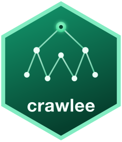

# crawlee 

> A tidy R interface for reproducible web crawling — inspired by the
> architecture of [Crawlee](https://crawlee.dev), implemented in pure R.

**crawlee** brings the unified-crawler idea to R: a deduplicating,
resumable request queue, content-type aware handlers, structured storage
and rich console logging via [cli](https://cli.r-lib.org). It targets
the collection and analysis of **public and governmental data** — HTML
pages, sitemaps, RSS feeds and PDF documents — with reproducibility as a
first-class concern.

It is built entirely on the R web-scraping ecosystem
([httr2](https://httr2.r-lib.org), [rvest](https://rvest.tidyverse.org),
[xml2](https://xml2.r-lib.org),
[chromote](https://rstudio.github.io/chromote/)) — no Node.js runtime
required.

## Installation

``` r

# install.packages("pak")
pak::pak("StrategicProjects/crawlee")
```

## Usage

``` r

library(crawlee)

resultado <- crawler("https://example.com") |>
  cr_options(delay = 0.5, max_depth = 2, respect_robots = TRUE) |>
  cr_use_http() |>
  cr_on_html(function(ctx) {
    ctx$push_data(list(
      url    = ctx$request$url,
      titulo = ctx$page |> rvest::html_element("h1") |> rvest::html_text2()
    ))
    ctx$enqueue_links(glob = "*/noticias/*")
  }) |>
  cr_run() |>
  cr_collect()

resultado
#> # A tibble: 1 × 2
#>   url                 titulo
#>   <chr>               <chr>
#> 1 https://example.com Example Domain
```

## Design principles

- **Reproducibility first** — deduplicating, resumable request queue;
  runs are meant to be deterministic and re-runnable.
- **No heavy mandatory dependencies** — DuckDB, chromote and pdftools
  are optional (`Suggests`), loaded only when used.
- **Tidy & predictable** — `cr_*` verbs compose with the native pipe and
  always return tibbles.
- **A polite web citizen** — rate limiting and `robots.txt` awareness by
  default (important for governmental portals).

## Roadmap

| Milestone | Scope                                               | Status |
|-----------|-----------------------------------------------------|--------|
| **M1**    | Core: queue, HTTP, HTML handlers, dataset, cli logs | ✅     |
| **M2**    | Sitemap & RSS discovery, robots.txt enforcement     | ✅     |
| **M3**    | PDF / document handlers (`pdftools`)                | ✅     |
| **M4**    | Headless browser backend (`chromote`)               | ✅     |
| **M5**    | RAG helpers (chunking, embeddings, export)          | ✅     |

Next: persistent/resumable dataset backends (DuckDB, Parquet) and
parallel/autoscaled fetching.

## License

MIT © André Leite. Part of the
[StrategicProjects](https://github.com/StrategicProjects) R toolkit for
public data.
